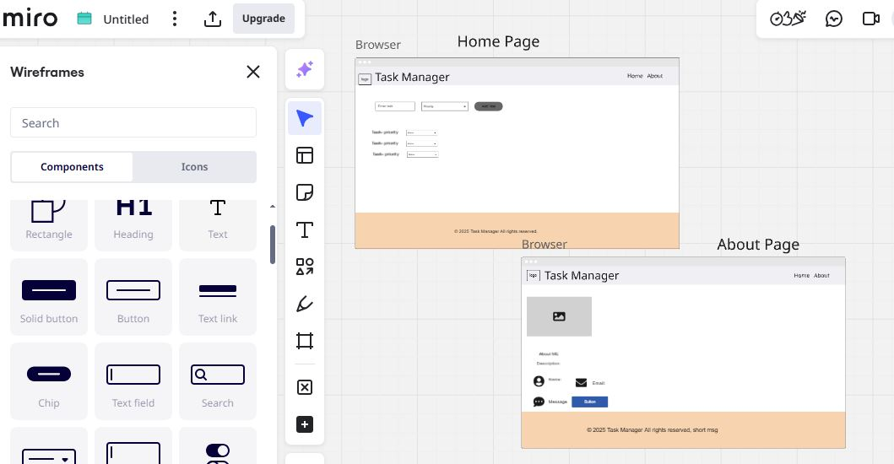

# Observations and Questions:

## Observations:

1. Writing clean and well-organized code makes it easier to fix bugs and make changes later.
2.Practice and patience are key when you're learning something new.

## Questions i still have:

1. Waht's the easiest way to center elements on pages? 
2. How can I make my website look good on phones?
3. What are good website or tools to help me practice web development?

## Time and efforts:

### This project took me more than 10 hours to complete, which is about the amount of time I expected it would take as a beginner. I spent a good portion of that time carefully reading the assignment and making sure I fully understood what was required. Then, I dedicated time to learning the basics of HTML and CSS so I could start building the structure and design of the website. I also explored how to use wireframes to plan out my layout visually before starting to code. Overall, the time spent was valuable and matched what I anticipated for this learning experience. ** This project was a valuable learning experience and gave me a solid foundation in front-end development. I'm excited to continue improving and learning more about web development.**

## Wireframe design made thorugh miro:

#Deplying link

https://jawharayahya.github.io/My-Tasks/ 